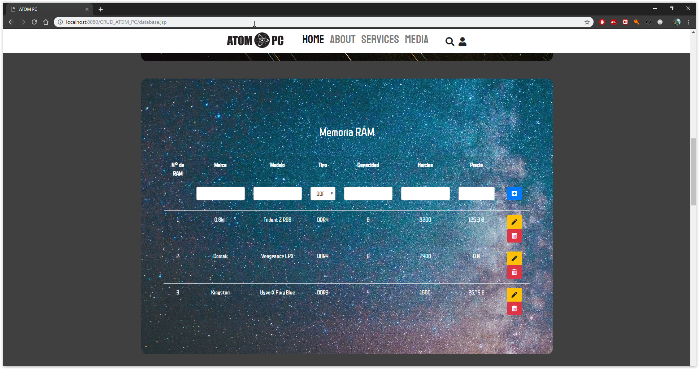

# CRUD ATOM PC

Este CRUD es la primera parte del proyecto, contiene la idea basica del proyecto que trata sobre hardware y ordenadores.
En este CRUD podrás añadir nuevos componentes a una base de datos, crear ordenadores con esos componentes y visualizar los ordenadores de manera muy simple.

## La página web

La página está hecha con Bootstrap y css, y tiene un diseño propio. Está pensada para que pueda ser ampliada para continuar el proyecto.

## Services

La página cuenta inicialmente con 3 servicios disponibles, el más importante es el de <i>base de datos</i> donde podremos añadir nuevos componentes al ordenador,
luego tenemos el configurador que nos da la oportunidad de crear configuraciones de ordenadores con los componentes, y por último la función de ver los ordenadores
creados de manera muy simple en una tabla.

## Base de datos de componentes

En esta página podremos añadir los diferentes tipos de componentes, cabe destacar que no están todos los componentes de un ordenador, solo los más esenciales.
Cada componente tiene su tabla en la base de datos con sus diferentes campos basicos, la aplicación web nos permite añadir nuevos, modificarlos y borrar cada tipo de componente, 
sin redireccionarnos a otra página.

El diseño de la página es provisional.

 

 

## Configurador de Ordenadores

Esta página nos permite guardar una configuración de un ordenador con los componentes que tenemos guardados.
Nos dejará seleccionar un componente de una lista generada con los componentes que ya tenemos. El diseño de esta página también es provisional. 

## Lista de ordenadores

Esta es la sección más basica y es solamente informátiva de momento, nos proporciona la tabla donde se guardan los ordenadores, ya creados.
Pero aquí solo nos dejará borrarlos.

